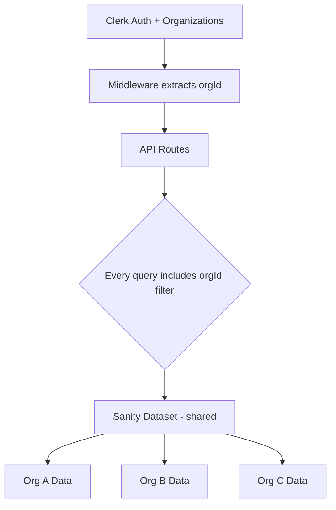

# Multi-Tenant Recruitment Platform - Architecture Plan

## Overview

Transform the existing single-tenant form-builder/recruitment app into a multi-tenant platform where each **organization** (company) has its own isolated data, team members, job positions, forms, and applications — all within a **shared Sanity dataset** using Clerk Organizations for auth/membership.

## Current State

| Layer        | Technology                                                 |
| ------------ | ---------------------------------------------------------- |
| Framework    | Next.js 16 with App Router                                 |
| Auth         | Clerk (individual users, `publicMetadata.role`)            |
| Database     | Sanity CMS (single dataset, no org concept)                |
| Architecture | Feature-Sliced Design (FSD) with clean architecture layers |
| Styling      | Tailwind CSS + Radix UI                                    |
| State        | Custom hooks + `apiClient` pattern                         |

### Current Architecture Pattern

```
app/(dashboard)/dashboard/[page]/page.jsx  → thin orchestrator
  ↓ imports from
features/[feature]/ui/[Page].jsx           → presentation
  ↓ uses
features/[feature]/model/use[Hook].js      → application logic
  ↓ calls
features/[feature]/api/[feature]Api.js     → client-side API calls via apiClient
  ↓ hits
app/api/[feature]/route.js                 → API route handler
  ↓ calls
features/[feature]/services/[service].js   → server-side business logic
  ↓ queries
sanity/queries/[domain]/[queries].js       → GROQ queries
```

### Current Ownership Model

- [`teamMember`](sanity/schemas/users/teamMember.js) reference on [`form`](sanity/schemas/forms/form.js), [`jobPosition`](sanity/schemas/recruitment/jobPosition.js)
- No organization concept — data is scoped to individual team members
- Roles managed via `user.publicMetadata.role` in Clerk (teamMember vs user)

---

## Target State

- **Auth**: Clerk Organizations (org membership, roles, org switching)
- **Database**: Same Sanity dataset with `organization` reference on all tenant-scoped documents
- **Ownership**: `organization` reference + `teamMember` reference (org-level isolation, member-level attribution)
- **Roles**: Admin, Recruiter, Hiring Manager, Viewer (managed via Clerk org roles)

---

## Architecture Approach: Shared Database with Organization Filtering



### Why Shared Database?

- Simpler infrastructure — single Sanity project/dataset
- Easier cross-org features like the unified `/careers` page
- Lower cost — no per-tenant dataset management
- Sanity GROQ queries naturally support filtering by `organization._ref`

---

## Schema Changes

### New: `organization` Document — [`sanity/schemas/organizations/organization.js`](sanity/schemas/organizations/organization.js)

```
organization {
  name: string (required)
  slug: string (required, unique) — URL-friendly identifier
  clerkOrgId: string (required, unique) — maps to Clerk Organization ID
  logo: image
  description: text
  website: string
  settings: object {
    brandColor: string
    careerPageEnabled: boolean
  }
  createdAt: datetime
  updatedAt: datetime
}
```

### Modified Schemas — Add `organization` Reference

| Schema                | File                                                                                                     | Changes                                                    |
| --------------------- | -------------------------------------------------------------------------------------------------------- | ---------------------------------------------------------- |
| `teamMember`          | [`sanity/schemas/users/teamMember.js`](sanity/schemas/users/teamMember.js)                               | Add `organization` reference, add `role` field             |
| `form`                | [`sanity/schemas/forms/form.js`](sanity/schemas/forms/form.js)                                           | Add `organization` reference                               |
| `jobPosition`         | [`sanity/schemas/recruitment/jobPosition.js`](sanity/schemas/recruitment/jobPosition.js)                 | Add `organization` reference                               |
| `application`         | [`sanity/schemas/recruitment/application.js`](sanity/schemas/recruitment/application.js)                 | Add `organization` reference (denormalized for query perf) |
| `conversation`        | [`sanity/schemas/messaging/conversation.js`](sanity/schemas/messaging/conversation.js)                   | Add `organization` reference                               |
| `evaluationScorecard` | [`sanity/schemas/recruitment/evaluationScorecard.js`](sanity/schemas/recruitment/evaluationScorecard.js) | Add `organization` reference (denormalized)                |
| `teamMemberInvite`    | [`sanity/schemas/users/teamMemberInvite.js`](sanity/schemas/users/teamMemberInvite.js)                   | Add `organization` reference                               |

### Role Field on `teamMember`

```
role: string
  options: admin | recruiter | hiring_manager | viewer
  default: recruiter
```

---

## New Feature: `organizations` (FSD Structure)

Following the existing FSD pattern, create a new feature module:

```
features/organizations/
├── api/
│   └── organizationsApi.js        # Client-side API calls
├── model/
│   ├── useOrganization.js         # Current org context hook
│   ├── useOrganizationMembers.js  # Org members management
│   └── useOrgContext.js           # Shared org context for all features
├── services/
│   ├── organizationService.js     # Server-side business logic
│   └── index.js
├── ui/
│   ├── OrganizationSettingsPage.jsx
│   ├── OrganizationMembersPage.jsx
│   ├── SelectOrganizationPage.jsx
│   └── components/
│       ├── OrgSwitcher.jsx        # Wraps Clerk OrganizationSwitcher
│       └── OrgMembersList.jsx
└── index.js                       # Public API
```

---

## Shared Utilities — Organization Context

### New: [`shared/lib/orgContext.js`](shared/lib/orgContext.js) — Server-Side Org Resolution

```js
// Used by ALL API routes that need org-scoped data
export async function resolveOrgContext() {
  const { userId, orgId, orgRole } = await auth();
  if (!orgId) throw new ApiError("No organization selected", 403);

  const [organization, teamMember] = await Promise.all([
    getOrganizationByClerkOrgId(orgId),
    getTeamMemberByClerkAndOrg(userId, orgId),
  ]);

  if (!organization) throw new ApiError("Organization not found", 404);
  if (!teamMember) throw new ApiError("Not a member of this org", 403);

  return { organization, teamMember, orgRole, orgId: organization._id };
}
```

### New: [`shared/hooks/useOrgContext.js`](shared/hooks/useOrgContext.js) — Client-Side Org Context

```js
// Wraps Clerk useOrganization for consistent access
export function useOrgContext() {
  const { organization, membership } = useOrganization();
  return {
    orgId: organization?.id,
    orgName: organization?.name,
    orgRole: membership?.role,
    isAdmin: membership?.role === "org:admin",
    // ...
  };
}
```

---

## Clerk Organizations Integration

```mermaid
flowchart LR
    A[User signs up via Clerk] --> B[Creates or joins Organization]
    B --> C[Clerk webhook fires]
    C --> D[/api/webhooks/clerk syncs to Sanity]
    D --> E[organization doc created/updated]
    D --> F[teamMember doc linked to org]
    B --> G[User selects active org in UI]
    G --> H[Clerk session includes orgId + orgRole]
    H --> I[All API calls scoped via resolveOrgContext]
```

### Webhook Handler — [`app/api/webhooks/clerk/route.js`](app/api/webhooks/clerk/route.js)

| Event                            | Action                                                 |
| -------------------------------- | ------------------------------------------------------ |
| `organization.created`           | Create `organization` doc in Sanity                    |
| `organization.updated`           | Update `organization` doc                              |
| `organizationMembership.created` | Create/link `teamMember` doc with org reference + role |
| `organizationMembership.updated` | Update `teamMember` role                               |
| `organizationMembership.deleted` | Remove org reference or soft-delete `teamMember`       |

---

## Middleware Changes — [`middleware.js`](middleware.js)

```
Current: clerkMiddleware() — auth only

Updated flow:
  1. Run Clerk auth (existing)
  2. For /dashboard/* routes:
     - If no orgId in session → redirect to /select-organization
     - If orgId present → continue (orgId available via auth())
  3. For /api/* routes (except public):
     - orgId validated inside resolveOrgContext()
```

---

## GROQ Query Changes — [`sanity/queries/`](sanity/queries/)

### New: [`sanity/queries/organizations/`](sanity/queries/organizations/)

```
sanity/queries/organizations/
├── index.js
└── organizations.js    # Org CRUD queries
```

### Modified Query Files

Every query file needs org-scoped variants:

| File                                                                                       | Change                                                   |
| ------------------------------------------------------------------------------------------ | -------------------------------------------------------- |
| [`sanity/queries/forms/forms.js`](sanity/queries/forms/forms.js)                           | Add `organization._ref == $orgId` filter                 |
| [`sanity/queries/forms/responses.js`](sanity/queries/forms/responses.js)                   | Add org filter via form reference                        |
| [`sanity/queries/forms/analytics.js`](sanity/queries/forms/analytics.js)                   | Add org filter                                           |
| [`sanity/queries/recruitment/jobPositions.js`](sanity/queries/recruitment/jobPositions.js) | Add org filter                                           |
| [`sanity/queries/recruitment/applications.js`](sanity/queries/recruitment/applications.js) | Add org filter                                           |
| [`sanity/queries/recruitment/careers.js`](sanity/queries/recruitment/careers.js)           | Keep cross-org for public page, add org info projections |
| [`sanity/queries/recruitment/scorecards.js`](sanity/queries/recruitment/scorecards.js)     | Add org filter                                           |
| [`sanity/queries/messaging/chat.js`](sanity/queries/messaging/chat.js)                     | Add org filter                                           |
| [`sanity/queries/users/teamMembers.js`](sanity/queries/users/teamMembers.js)               | Add org filter                                           |
| [`sanity/queries/users/teamMemberInvites.js`](sanity/queries/users/teamMemberInvites.js)   | Add org filter                                           |

**Example — Before:**

```groq
*[_type == "form" && teamMember._ref == $teamMemberId]
```

**Example — After:**

```groq
*[_type == "form" && organization._ref == $orgId]
```

**Careers page (cross-org):**

```groq
*[_type == "jobPosition" && status == "open"] {
  ...,
  "organizationName": organization->name,
  "organizationLogo": organization->logo,
  "organizationSlug": organization->slug
}
```

---

## API Route Changes

### Pattern: Every Tenant-Scoped Route Uses `resolveOrgContext()`

**Before** (current pattern in [`app/api/forms/route.js`](app/api/forms/route.js)):

```js
const user = await currentUser();
const teamMember = await client.fetch(query, { clerkId: user.id });
const forms = await getForms(teamMember._id);
```

**After:**

```js
const { organization, teamMember } = await resolveOrgContext();
const forms = await getForms(organization._id);
```

### Routes Requiring Updates

| Route         | File                                                                                                             |
| ------------- | ---------------------------------------------------------------------------------------------------------------- |
| Forms CRUD    | [`app/api/forms/route.js`](app/api/forms/route.js), [`app/api/forms/[id]/route.js`](app/api/forms/[id]/route.js) |
| Form actions  | `publish`, `close`, `submit` routes                                                                              |
| Job Positions | [`app/api/job-positions/route.js`](app/api/job-positions/route.js), `[id]` routes                                |
| Applications  | [`app/api/applications/route.js`](app/api/applications/route.js), `[id]` routes                                  |
| Scorecards    | All scorecard routes                                                                                             |
| Conversations | [`app/api/conversations/route.js`](app/api/conversations/route.js), `[id]` routes                                |
| Team Members  | All team member routes                                                                                           |
| Analytics     | [`app/api/analytics/[formId]/route.js`](app/api/analytics/[formId]/route.js)                                     |
| Responses     | All response routes                                                                                              |

### New Routes

| Route                                         | Purpose                         |
| --------------------------------------------- | ------------------------------- |
| `app/api/webhooks/clerk/route.js`             | Handle Clerk org webhook events |
| `app/api/organizations/route.js`              | Get current org details         |
| `app/api/organizations/[id]/route.js`         | Update org settings             |
| `app/api/organizations/[id]/members/route.js` | List/manage org members         |

### Endpoints Update — [`shared/api/endpoints.js`](shared/api/endpoints.js)

Add new organization endpoints:

```js
// Organizations
ORGANIZATIONS: '/api/organizations',
ORGANIZATION_BY_ID: id => `/api/organizations/${id}`,
ORGANIZATION_MEMBERS: id => `/api/organizations/${id}/members`,
```

---

## Service Layer Changes — Following FSD Pattern

### Modified Services

Each service that currently takes `teamMemberId` needs to accept `orgId` instead:

| Service                       | File                                                                                                                                                 | Change                                                |
| ----------------------------- | ---------------------------------------------------------------------------------------------------------------------------------------------------- | ----------------------------------------------------- |
| `formService`                 | [`features/forms/services/formService.js`](features/forms/services/formService.js)                                                                   | `getForms(orgId)` instead of `getForms(teamMemberId)` |
| `jobPositionService`          | [`features/job-positions/services/jobPositionService.js`](features/job-positions/services/jobPositionService.js)                                     | Org-scoped queries                                    |
| `applicationService`          | [`features/applications/services/applicationService.js`](features/applications/services/applicationService.js)                                       | Org-scoped queries                                    |
| `chatService`                 | [`features/chat/services/chatService.js`](features/chat/services/chatService.js)                                                                     | Org-scoped queries                                    |
| `scorecardService`            | [`features/scorecards/services/scorecardService.js`](features/scorecards/services/scorecardService.js)                                               | Org-scoped queries                                    |
| `analyticsService`            | [`features/analytics/services/analyticsService.js`](features/analytics/services/analyticsService.js)                                                 | Org-scoped queries                                    |
| `teamMemberManagementService` | [`features/team-member-management/services/teamMemberManagementService.js`](features/team-member-management/services/teamMemberManagementService.js) | Org-scoped queries                                    |

### New Service

| Service               | File                                                     |
| --------------------- | -------------------------------------------------------- |
| `organizationService` | `features/organizations/services/organizationService.js` |

---

## UI Changes

### Dashboard Layout — [`app/(dashboard)/layout.jsx`](<app/(dashboard)/layout.jsx>)

- Add Clerk `OrganizationSwitcher` component to [`shared/components/layout/Sidebar.jsx`](shared/components/layout/Sidebar.jsx) or [`shared/components/layout/DashboardHeader.jsx`](shared/components/layout/DashboardHeader.jsx)

### New Pages

| Page                | Route                                                      | Feature                                                  |
| ------------------- | ---------------------------------------------------------- | -------------------------------------------------------- |
| Select Organization | `app/(dashboard)/select-organization/page.jsx`             | `features/organizations/ui/SelectOrganizationPage.jsx`   |
| Org Settings        | `app/(dashboard)/dashboard/settings/organization/page.jsx` | `features/organizations/ui/OrganizationSettingsPage.jsx` |
| Org Members         | `app/(dashboard)/dashboard/settings/members/page.jsx`      | `features/organizations/ui/OrganizationMembersPage.jsx`  |

### Modified Pages

| Page                                                                                                                       | Change                                                  |
| -------------------------------------------------------------------------------------------------------------------------- | ------------------------------------------------------- |
| Careers Page ([`features/careers/ui/CareersPage.jsx`](features/careers/ui/CareersPage.jsx))                                | Add company filter, show org branding on position cards |
| Careers Filters ([`features/careers/ui/components/CareersFilters.jsx`](features/careers/ui/components/CareersFilters.jsx)) | Add organization/company filter dropdown                |
| Settings Page ([`app/(dashboard)/dashboard/settings/page.jsx`](<app/(dashboard)/dashboard/settings/page.jsx>))             | Add org settings tab/link                               |

### Role-Based UI Visibility

| Role                                      | Permissions                                         |
| ----------------------------------------- | --------------------------------------------------- |
| **Admin** (`org:admin`)                   | Full access: manage members, org settings, all CRUD |
| **Recruiter** (`org:recruiter`)           | Create/edit positions, forms, manage applications   |
| **Hiring Manager** (`org:hiring_manager`) | View assigned positions, submit scorecards          |
| **Viewer** (`org:viewer`)                 | Read-only access to positions and applications      |

Use existing [`features/auth/components/RoleGuard.jsx`](features/auth/components/RoleGuard.jsx) pattern — extend it to support org roles.

---

## Data Migration Strategy

1. Create a **default organization** document in Sanity
2. Run migration script to:
   - Add `organization` reference to all existing `teamMember`, `form`, `jobPosition`, `application`, `conversation`, `evaluationScorecard`, `teamMemberInvite` documents
   - Set all existing `teamMember` docs to `role: "admin"`
3. Create corresponding Clerk Organization and add existing team members

Migration script location: `scripts/migrate-to-multi-tenant.js`

---

## Sanity Studio Updates — [`sanity/structure.js`](sanity/structure.js)

- Add `organization` document type to schema registry ([`sanity/schemas/index.js`](sanity/schemas/index.js))
- Add organization section to Studio structure
- Consider org-aware filtering in Studio for admin users

---

## Implementation Steps (Following FSD Architecture)

### Phase 1: Foundation (Schema + Auth)

1. Create `organization` Sanity schema at `sanity/schemas/organizations/organization.js`
2. Register schema in [`sanity/schemas/index.js`](sanity/schemas/index.js)
3. Add `organization` reference + `role` field to all tenant-scoped schemas
4. Create organization GROQ queries at `sanity/queries/organizations/`
5. Set up Clerk Organizations in Clerk dashboard (manual step)
6. Create Clerk webhook handler at `app/api/webhooks/clerk/route.js`
7. Create `shared/lib/orgContext.js` — `resolveOrgContext()` utility

### Phase 2: API Layer (Server-Side Org Scoping)

8. Update [`middleware.js`](middleware.js) to enforce org selection on dashboard routes
9. Update all GROQ queries in `sanity/queries/` to filter by `organization._ref`
10. Update all service files in `features/*/services/` to use org-scoped queries
11. Update all API routes in `app/api/` to use `resolveOrgContext()`
12. Create organization API routes (`app/api/organizations/`)
13. Update [`shared/api/endpoints.js`](shared/api/endpoints.js) with new endpoints

### Phase 3: UI Layer (Client-Side)

14. Create `features/organizations/` feature module (FSD structure)
15. Add `OrganizationSwitcher` to dashboard layout/sidebar
16. Create select-organization page
17. Create organization settings + members pages
18. Update careers page with cross-org listing and company filter
19. Extend [`RoleGuard.jsx`](features/auth/components/RoleGuard.jsx) for org roles
20. Update [`useAuth.js`](features/auth/hooks/useAuth.js) to include org context

### Phase 4: Migration + Polish

21. Write data migration script (`scripts/migrate-to-multi-tenant.js`)
22. Update Sanity Studio structure for org-aware browsing
23. Add role-based access control checks to all API routes
24. Test cross-org data isolation thoroughly

---

## Security Considerations

- **Data isolation**: Every GROQ query MUST include `organization._ref == $orgId` — no exceptions for tenant-scoped data
- **API authorization**: Validate org membership on every request via `resolveOrgContext()`
- **Role enforcement**: Check `orgRole` before destructive operations (use middleware or per-route checks)
- **Webhook verification**: Verify Clerk webhook signatures using `svix` package
- **Public routes**: `/careers` and `/api/careers` remain public (cross-org) — no org filter needed
- **Sanity Studio**: Restrict access or add org-aware document filters

---

## File Impact Summary

| Category                | Files Affected                                    |
| ----------------------- | ------------------------------------------------- |
| New Sanity schemas      | 1 new file + 1 new index                          |
| Modified Sanity schemas | 7 files                                           |
| New GROQ queries        | 2 new files                                       |
| Modified GROQ queries   | 10 files                                          |
| New API routes          | 4 new route files                                 |
| Modified API routes     | ~25 route files                                   |
| New feature module      | ~10 new files (organizations feature)             |
| Modified services       | 7 service files                                   |
| Modified shared utils   | 3 files (endpoints, middleware, auth hooks)       |
| New shared utils        | 2 files (orgContext server + client)              |
| Modified UI components  | ~5 files (sidebar, careers, settings, role guard) |
| New UI pages            | 3 new pages                                       |
| Migration script        | 1 new file                                        |
| **Total**               | **~75 files touched**                             |
