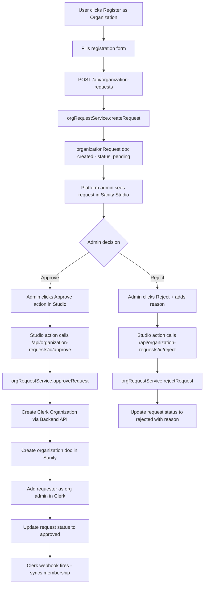
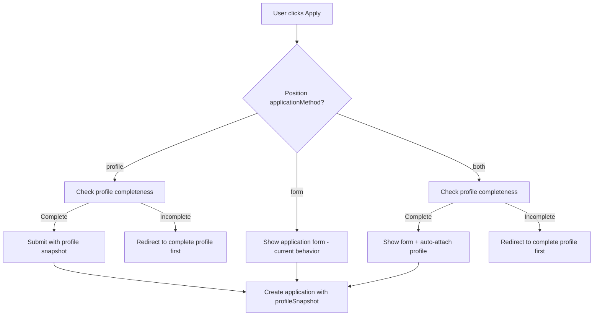

# User Profiles & Organization Registration Plan

## Overview

Add two major features to the platform:

1. **User Profiles** — Users have complete profiles (like VOIS) with resume, education, work experience, skills, etc. When applying to a position, the org chooses whether applicants apply with their profile, a custom form, or both.
2. **Organization Registration** — Anyone can submit a request to register as an organization. A platform admin reviews and approves/rejects from Sanity Studio. On approval, a Clerk Organization is auto-created and the requester becomes the org admin.

---

## Current Architecture Pattern

The project follows a strict layered architecture:

```
sanity/schemas/          → Sanity document type definitions
sanity/queries/          → Pure GROQ query strings (no logic)
features/*/services/     → Server-side: imports queries from sanity/queries/, calls client.fetch()
features/*/api/          → Client-side: uses apiClient + API_ENDPOINTS
features/*/model/        → Client-side hooks: uses feature api layer
features/*/ui/           → React components: uses model hooks
app/api/                 → API routes: calls services ONLY (never queries directly)
app/(routes)/            → Thin page orchestrators: imports from features/*/ui/
shared/api/endpoints.js  → Centralized API endpoint definitions
shared/api/client.js     → HTTP client wrapper
```

**Key rules:**

- API routes call **services** only — never import queries directly
- Services import **queries** from `sanity/queries/` and use `client.fetch(query, params)`
- Client-side api layer uses `apiClient` + `API_ENDPOINTS`
- UI components use **model hooks** — never call APIs directly

---

## Current State

- **User schema** ([`sanity/schemas/users/user.js`](sanity/schemas/users/user.js)) — minimal: `clerkId`, `name`, `email`, `avatar`, timestamps
- **User sync** ([`app/api/auth/sync/route.js`](app/api/auth/sync/route.js)) — creates basic user doc on first sign-in
- **Application flow** ([`app/api/careers/[id]/apply/route.js`](app/api/careers/[id]/apply/route.js)) — always form-based, answers stored in application doc
- **Organization** ([`sanity/schemas/organizations/organization.js`](sanity/schemas/organizations/organization.js)) — created via Clerk webhook, no self-registration
- **Job Position** ([`sanity/schemas/recruitment/jobPosition.js`](sanity/schemas/recruitment/jobPosition.js)) — has optional `form` reference but no application method choice

---

## Part 1: Enhanced User Profiles

### 1.1 Schema Changes — [`sanity/schemas/users/user.js`](sanity/schemas/users/user.js)

Add the following fields to the existing `user` schema:

```
user {
  // Existing fields (unchanged)
  clerkId: string
  name: string
  email: string
  avatar: image
  createdAt: datetime
  updatedAt: datetime

  // NEW: Profile fields
  phone: string
  headline: string              // e.g. "Senior Software Engineer"
  bio: text                     // Short summary/about me
  location: string              // City, Country
  dateOfBirth: date

  // NEW: Resume/CV
  resume: file                  // Uploaded PDF/DOC
  resumeUrl: url                // Or external link

  // NEW: Work Experience (array)
  workExperience: array of object {
    _key: string
    company: string
    title: string
    startDate: date
    endDate: date               // null = current
    isCurrent: boolean
    description: text
  }

  // NEW: Education (array)
  education: array of object {
    _key: string
    institution: string
    degree: string              // e.g. "Bachelor of Science"
    fieldOfStudy: string
    startDate: date
    endDate: date
    grade: string               // optional GPA/grade
  }

  // NEW: Skills
  skills: array of string

  // NEW: Languages
  languages: array of object {
    _key: string
    language: string
    proficiency: string         // native | fluent | intermediate | basic
  }

  // NEW: Social/Links
  linkedinUrl: url
  githubUrl: url
  portfolioUrl: url

  // NEW: Profile completeness
  profileComplete: boolean      // set when all required fields filled
}
```

### 1.2 Query Layer — `sanity/queries/users/userProfile.js`

New file with pure GROQ query strings:

```js
export const userProfileQueries = {
  getFullProfile: `*[_type == "user" && clerkId == $clerkId][0] {
    ...,
    "resumeUrl": resume.asset->url
  }`,

  getProfileById: `*[_type == "user" && _id == $userId][0] {
    ...,
    "resumeUrl": resume.asset->url
  }`,

  getProfileCompleteness: `*[_type == "user" && clerkId == $clerkId][0] {
    _id,
    name,
    email,
    phone,
    headline,
    bio,
    location,
    "hasResume": defined(resume) || defined(resumeUrl),
    "hasWorkExperience": count(workExperience) > 0,
    "hasEducation": count(education) > 0,
    "hasSkills": count(skills) > 0,
    profileComplete
  }`,
};
```

Update `sanity/queries/users/index.js` to export the new queries.

### 1.3 Service Layer — `features/user-profile/services/userProfileService.js`

```js
// Imports queries from sanity/queries/users/userProfile.js
// Uses client.fetch(query, params) for reads
// Uses client.patch() for updates
// Uses client.assets.upload() for resume upload

export async function getFullProfile(clerkId) { ... }
export async function updateProfile(userId, data) { ... }
export async function uploadResume(userId, file) { ... }
export async function getProfileCompleteness(clerkId) { ... }
export async function getProfileById(userId) { ... }
```

### 1.4 API Routes

| Route                            | Method | Purpose                       | Calls                                         |
| -------------------------------- | ------ | ----------------------------- | --------------------------------------------- |
| `/api/user/profile`              | GET    | Get current user profile      | `userProfileService.getFullProfile()`         |
| `/api/user/profile`              | PUT    | Update profile fields         | `userProfileService.updateProfile()`          |
| `/api/user/profile/resume`       | POST   | Upload resume file            | `userProfileService.uploadResume()`           |
| `/api/user/profile/completeness` | GET    | Get profile completion status | `userProfileService.getProfileCompleteness()` |

### 1.5 Client-Side API Layer — `features/user-profile/api/userProfileApi.js`

```js
// Uses apiClient + API_ENDPOINTS pattern
export const userProfileApi = {
  async getProfile() {
    return apiClient.get(API_ENDPOINTS.USER_PROFILE);
  },
  async updateProfile(data) {
    return apiClient.put(API_ENDPOINTS.USER_PROFILE, data);
  },
  async uploadResume(formData) {
    return apiClient.post(API_ENDPOINTS.USER_PROFILE_RESUME, formData);
  },
  async getCompleteness() {
    return apiClient.get(API_ENDPOINTS.USER_PROFILE_COMPLETENESS);
  },
};
```

### 1.6 New Endpoints — add to [`shared/api/endpoints.js`](shared/api/endpoints.js)

```js
// User Profile
USER_PROFILE: "/api/user/profile",
USER_PROFILE_RESUME: "/api/user/profile/resume",
USER_PROFILE_COMPLETENESS: "/api/user/profile/completeness",
```

### 1.7 Model Hooks — `features/user-profile/model/`

```
useUserProfile.js       — fetch/manage profile data via userProfileApi
useProfileCompletion.js — track profile completeness via userProfileApi
```

### 1.8 UI Components — `features/user-profile/ui/`

```
UserProfilePage.jsx             — View own profile (read-only display)
EditProfilePage.jsx             — Edit profile form (multi-section)
ProfileCompletionBanner.jsx     — Shows completion % + prompts to fill missing sections
components/
  ProfileHeader.jsx             — Avatar, name, headline, location
  WorkExperienceSection.jsx     — List + add/edit/remove work entries
  EducationSection.jsx          — List + add/edit/remove education entries
  SkillsSection.jsx             — Tag-style skills input
  LanguagesSection.jsx          — Language + proficiency selector
  ResumeUploadSection.jsx       — File upload with drag-and-drop
```

### 1.9 New Pages

| Route                | File                                    | Imports From                               |
| -------------------- | --------------------------------------- | ------------------------------------------ |
| `/user/profile`      | `app/(user)/user/profile/page.jsx`      | `features/user-profile/ui/UserProfilePage` |
| `/user/profile/edit` | `app/(user)/user/profile/edit/page.jsx` | `features/user-profile/ui/EditProfilePage` |

### 1.10 Feature Module Structure

```
features/user-profile/
├── api/
│   └── userProfileApi.js          # Client-side: apiClient + API_ENDPOINTS
├── model/
│   ├── useUserProfile.js          # Hook: uses userProfileApi
│   └── useProfileCompletion.js    # Hook: uses userProfileApi
├── services/
│   ├── userProfileService.js      # Server-side: imports from sanity/queries/
│   └── index.js
├── ui/
│   ├── UserProfilePage.jsx        # Uses useUserProfile hook
│   ├── EditProfilePage.jsx        # Uses useUserProfile hook
│   ├── ProfileCompletionBanner.jsx
│   └── components/
│       ├── ProfileHeader.jsx
│       ├── WorkExperienceSection.jsx
│       ├── EducationSection.jsx
│       ├── SkillsSection.jsx
│       ├── LanguagesSection.jsx
│       └── ResumeUploadSection.jsx
└── index.js                       # Public API exports
```

---

## Part 2: Organization Registration

### 2.1 New Schema — `sanity/schemas/organizations/organizationRequest.js`

```
organizationRequest {
  // Requester info
  requestedBy: reference -> user
  contactEmail: string
  contactPhone: string

  // Organization info
  orgName: string (required)
  orgSlug: slug (auto from orgName)
  orgDescription: text
  orgWebsite: url
  orgLogo: image
  orgIndustry: string          // dropdown: tech, healthcare, finance, education, etc.
  orgSize: string              // dropdown: 1-10, 11-50, 51-200, 201-500, 500+

  // Status & Review
  status: string               // pending | approved | rejected
  reviewedAt: datetime
  reviewedBy: string           // admin name/email who reviewed
  rejectionReason: text        // filled when rejected

  // Result (set after approval)
  clerkOrgId: string           // Clerk Organization ID created on approval
  organization: reference -> organization  // Sanity org doc created on approval

  createdAt: datetime
  updatedAt: datetime
}
```

Register in [`sanity/schemas/organizations/index.js`](sanity/schemas/organizations/index.js) and [`sanity/schemas/index.js`](sanity/schemas/index.js).

### 2.2 Query Layer — `sanity/queries/organizations/organizationRequests.js`

```js
export const orgRequestQueries = {
  getByUser: `*[_type == "organizationRequest" && requestedBy._ref == $userId] | order(createdAt desc) { ... }`,
  getById: `*[_type == "organizationRequest" && _id == $id][0] { ..., "requestedBy": requestedBy->{ _id, name, email, clerkId } }`,
  getPending: `*[_type == "organizationRequest" && status == "pending"] | order(createdAt asc) { ... }`,
  checkDuplicate: `count(*[_type == "organizationRequest" && requestedBy._ref == $userId && status == "pending"])`,
};
```

Update `sanity/queries/organizations/index.js` to export.

### 2.3 Service Layer — `features/organization-requests/services/orgRequestService.js`

```js
// Imports queries from sanity/queries/organizations/organizationRequests.js
// Uses client.fetch() for reads, client.create() for writes

export async function createRequest(userId, data) { ... }
export async function getRequestsByUser(userId) { ... }
export async function getRequestById(id) { ... }
export async function approveRequest(id, adminInfo) { ... }  // Creates Clerk Org + Sanity org
export async function rejectRequest(id, reason, adminInfo) { ... }
```

The `approveRequest` function will:

1. Call `clerkClient().organizations.createOrganization()` to create Clerk Organization
2. Create `organization` doc in Sanity with the returned `clerkOrgId`
3. Call `clerkClient().organizations.createOrganizationMembership()` to add requester as admin
4. Update `organizationRequest` doc with `status: "approved"`, `clerkOrgId`, `organization` ref

### 2.4 API Routes

| Route                                     | Method | Purpose                      | Calls                                   |
| ----------------------------------------- | ------ | ---------------------------- | --------------------------------------- |
| `/api/organization-requests`              | POST   | Submit new request           | `orgRequestService.createRequest()`     |
| `/api/organization-requests`              | GET    | List user's own requests     | `orgRequestService.getRequestsByUser()` |
| `/api/organization-requests/[id]`         | GET    | Get request details          | `orgRequestService.getRequestById()`    |
| `/api/organization-requests/[id]/approve` | POST   | Approve (from Studio action) | `orgRequestService.approveRequest()`    |
| `/api/organization-requests/[id]/reject`  | POST   | Reject (from Studio action)  | `orgRequestService.rejectRequest()`     |

### 2.5 Client-Side API Layer — `features/organization-requests/api/orgRequestApi.js`

```js
export const orgRequestApi = {
  async submitRequest(data) {
    return apiClient.post(API_ENDPOINTS.ORG_REQUESTS, data);
  },
  async getMyRequests() {
    return apiClient.get(API_ENDPOINTS.ORG_REQUESTS);
  },
  async getRequestById(id) {
    return apiClient.get(API_ENDPOINTS.ORG_REQUEST_BY_ID(id));
  },
};
```

### 2.6 New Endpoints — add to [`shared/api/endpoints.js`](shared/api/endpoints.js)

```js
// Organization Requests
ORG_REQUESTS: "/api/organization-requests",
ORG_REQUEST_BY_ID: (id) => `/api/organization-requests/${id}`,
ORG_REQUEST_APPROVE: (id) => `/api/organization-requests/${id}/approve`,
ORG_REQUEST_REJECT: (id) => `/api/organization-requests/${id}/reject`,
```

### 2.7 Model Hooks — `features/organization-requests/model/`

```
useOrgRequest.js        — submit request, fetch own requests via orgRequestApi
useOrgRequestStatus.js  — poll/check request status
```

### 2.8 UI Components — `features/organization-requests/ui/`

Split into small, focused components:

```
RegisterOrgPage.jsx                    — Orchestrator (thin, ~30 lines)
OrgRequestStatusPage.jsx               — Orchestrator for status view (thin, ~30 lines)

components/
  registration-form/
    OrgRegistrationForm.jsx            — Form orchestrator: composes field sections
    OrgBasicInfoFields.jsx             — Name, slug, description fields
    OrgContactFields.jsx               — Contact email, phone fields
    OrgDetailsFields.jsx               — Website, industry, size dropdowns
    OrgLogoUpload.jsx                  — Logo image upload with preview
    OrgRegistrationSubmitBar.jsx       — Submit button + terms

  request-status/
    RequestStatusCard.jsx              — Status badge + timeline
    RequestStatusBadge.jsx             — Colored badge: pending/approved/rejected
    RequestRejectionReason.jsx         — Rejection reason display
    RequestApprovedActions.jsx         — Go to Dashboard button after approval
    RequestsList.jsx                   — List of user's requests
    RequestListItem.jsx                — Single request row in list
```

### 2.9 New Pages

| Route                         | File                                             | Imports From                                             |
| ----------------------------- | ------------------------------------------------ | -------------------------------------------------------- |
| `/register-organization`      | `app/(public)/register-organization/page.jsx`    | `features/organization-requests/ui/RegisterOrgPage`      |
| `/user/organization-requests` | `app/(user)/user/organization-requests/page.jsx` | `features/organization-requests/ui/OrgRequestStatusPage` |

### 2.10 Sanity Studio — Custom Document Actions

Create custom document actions for `organizationRequest` type:

**File: `sanity/actions/approveOrgRequestAction.js`**

- Shows "Approve" button when status is "pending"
- Calls `/api/organization-requests/[id]/approve` endpoint
- Updates document status in Studio

**File: `sanity/actions/rejectOrgRequestAction.js`**

- Shows "Reject" button when status is "pending"
- Prompts for rejection reason
- Calls `/api/organization-requests/[id]/reject` endpoint

Register in [`sanity.config.js`](sanity.config.js) via `document.actions` config for `organizationRequest` type.

### 2.11 Sanity Studio Structure Update — [`sanity/structure.js`](sanity/structure.js)

Add new top-level section:

```
Platform Admin
├── Organization Requests
│   ├── Pending Requests (filtered by status == "pending")
│   ├── Approved Requests (filtered by status == "approved")
│   └── Rejected Requests (filtered by status == "rejected")
└── All Organizations (existing documentTypeList)
```

### 2.12 Registration Flow



### 2.13 Feature Module Structure

```
features/organization-requests/
├── api/
│   └── orgRequestApi.js           # Client-side: apiClient + API_ENDPOINTS
├── model/
│   ├── useOrgRequest.js           # Hook: uses orgRequestApi
│   └── useOrgRequestStatus.js     # Hook: uses orgRequestApi
├── services/
│   ├── orgRequestService.js       # Server-side: imports from sanity/queries/
│   └── index.js
├── ui/
│   ├── RegisterOrgPage.jsx        # Uses useOrgRequest hook
│   ├── OrgRequestStatusPage.jsx   # Uses useOrgRequestStatus hook
│   └── components/
│       ├── OrgRegistrationForm.jsx
│       └── RequestStatusCard.jsx
└── index.js                       # Public API exports
```

---

## Part 3: Application Method on Job Positions

### 3.1 Schema Change — [`sanity/schemas/recruitment/jobPosition.js`](sanity/schemas/recruitment/jobPosition.js)

Add `applicationMethod` field:

```js
{
  name: "applicationMethod",
  title: "Application Method",
  type: "string",
  options: {
    list: [
      { title: "Apply with Profile", value: "profile" },
      { title: "Apply with Form", value: "form" },
      { title: "Both - Profile + Form", value: "both" },
    ],
  },
  initialValue: "form",
  description: "How applicants should apply to this position",
}
```

### 3.2 Schema Change — [`sanity/schemas/recruitment/application.js`](sanity/schemas/recruitment/application.js)

Add `profileSnapshot` field to capture profile data at application time:

```js
{
  name: "profileSnapshot",
  title: "Profile Snapshot",
  type: "object",
  description: "Copy of applicant profile at time of application",
  fields: [
    { name: "headline", title: "Headline", type: "string" },
    { name: "bio", title: "Bio", type: "text" },
    { name: "phone", title: "Phone", type: "string" },
    { name: "location", title: "Location", type: "string" },
    { name: "resumeUrl", title: "Resume URL", type: "url" },
    { name: "skills", title: "Skills", type: "array", of: [{ type: "string" }] },
    { name: "linkedinUrl", title: "LinkedIn", type: "url" },
    { name: "portfolioUrl", title: "Portfolio", type: "url" },
    {
      name: "workExperience", title: "Work Experience", type: "array",
      of: [{ type: "object", fields: [
        { name: "company", type: "string" },
        { name: "title", type: "string" },
        { name: "startDate", type: "date" },
        { name: "endDate", type: "date" },
        { name: "isCurrent", type: "boolean" },
        { name: "description", type: "text" },
      ]}]
    },
    {
      name: "education", title: "Education", type: "array",
      of: [{ type: "object", fields: [
        { name: "institution", type: "string" },
        { name: "degree", type: "string" },
        { name: "fieldOfStudy", type: "string" },
        { name: "startDate", type: "date" },
        { name: "endDate", type: "date" },
      ]}]
    },
  ]
}
```

### 3.3 Query Changes — `sanity/queries/recruitment/careers.js`

Update `getPublicPositionById` to include `applicationMethod`:

```groq
*[_type == "jobPosition" && _id == $id && status == "open"][0] {
  ...,
  applicationMethod,
  // ... existing projections
}
```

### 3.4 Updated Apply Flow



### 3.5 Service Changes — `features/careers/services/careerService.js`

Update `submitApplication()` to:

- Accept optional `profileSnapshot` data
- Store it on the application doc alongside `answers`

### 3.6 API Route Changes — [`app/api/careers/[id]/apply/route.js`](app/api/careers/[id]/apply/route.js)

Update to:

1. Fetch position to check `applicationMethod` (via `careerService`)
2. If `profile` or `both`: fetch user profile via `userProfileService.getProfileById()`
3. Validate profile completeness if needed
4. Build `profileSnapshot` from profile data
5. Call `careerService.submitApplication()` with both `answers` and `profileSnapshot`

### 3.7 UI Changes for Apply Page

Update the careers apply page/feature. Split into small components:

```
features/careers/ui/apply/
  ApplyPage.jsx                        — Orchestrator (thin, ~40 lines)
  ApplyWithProfileSection.jsx          — Profile preview + submit button
  ApplyWithFormSection.jsx             — Form rendering (existing, extracted)
  ApplyWithBothSection.jsx             — Profile preview + form combined
  ProfileIncompleteWarning.jsx         — Banner: complete profile first
  components/
    ProfilePreviewCard.jsx             — Read-only profile summary for review
    ProfilePreviewHeader.jsx           — Name, headline, avatar
    ProfilePreviewExperience.jsx       — Work experience list (compact)
    ProfilePreviewEducation.jsx        — Education list (compact)
    ProfilePreviewSkills.jsx           — Skills tags (compact)
    ProfilePreviewResume.jsx           — Resume link/download
    ApplicationSubmitButton.jsx        — Submit button with loading state
```

Behavior:

- Check `applicationMethod` from position data
- If `profile`: show `ApplyWithProfileSection` — profile preview + submit
- If `form`: show `ApplyWithFormSection` — form (current behavior)
- If `both`: show `ApplyWithBothSection` — profile preview + form below
- If profile incomplete: show `ProfileIncompleteWarning` with link to edit profile

### 3.8 UI Changes for Position Create/Edit

Update the job position create/edit feature to include `applicationMethod` selector dropdown. Add:

```
features/job-positions/ui/components/
  ApplicationMethodSelector.jsx        — Dropdown to choose profile/form/both
```

### 3.9 UI Changes for Application Detail (Org Dashboard)

Update the application detail view to show `profileSnapshot` data when present. Add:

```
features/applications/ui/components/
  profile-snapshot/
    ProfileSnapshotSection.jsx         — Orchestrator for profile data display
    ProfileSnapshotHeader.jsx          — Name, headline, contact info
    ProfileSnapshotExperience.jsx      — Work experience entries
    ProfileSnapshotEducation.jsx       — Education entries
    ProfileSnapshotSkills.jsx          — Skills tags
    ProfileSnapshotResume.jsx          — Resume download link
    ProfileSnapshotLinks.jsx           — LinkedIn, portfolio links
```

---

## Implementation Order

### Phase 1: Enhanced User Schema

1. Update [`sanity/schemas/users/user.js`](sanity/schemas/users/user.js) with all new profile fields
2. Create `sanity/queries/users/userProfile.js` with GROQ queries
3. Update `sanity/queries/users/index.js` to export new queries

### Phase 2: User Profile Service + API

4. Create `features/user-profile/services/userProfileService.js` (imports from `sanity/queries/`)
5. Create API routes: `/api/user/profile` (GET, PUT), `/api/user/profile/resume` (POST), `/api/user/profile/completeness` (GET)
6. Add new endpoints to [`shared/api/endpoints.js`](shared/api/endpoints.js)

### Phase 3: User Profile Client + UI

7. Create `features/user-profile/api/userProfileApi.js` (uses `apiClient` + `API_ENDPOINTS`)
8. Create `features/user-profile/model/useUserProfile.js` and `useProfileCompletion.js`
9. Create `features/user-profile/ui/` components (profile page, edit page, sections)
10. Create page files at `app/(user)/user/profile/page.jsx` and `app/(user)/user/profile/edit/page.jsx`
11. Add `ProfileCompletionBanner` to user layout
12. Update user navigation/header with profile link

### Phase 4: Organization Request Schema + Queries

13. Create `sanity/schemas/organizations/organizationRequest.js`
14. Register in [`sanity/schemas/organizations/index.js`](sanity/schemas/organizations/index.js) and [`sanity/schemas/index.js`](sanity/schemas/index.js)
15. Create `sanity/queries/organizations/organizationRequests.js`
16. Update `sanity/queries/organizations/index.js`

### Phase 5: Org Request Service + API

17. Create `features/organization-requests/services/orgRequestService.js` (imports from `sanity/queries/`)
18. Create API routes: `/api/organization-requests` (GET, POST), `/api/organization-requests/[id]` (GET), approve + reject routes
19. Add new endpoints to [`shared/api/endpoints.js`](shared/api/endpoints.js)

### Phase 6: Sanity Studio Approval Workflow

20. Create `sanity/actions/approveOrgRequestAction.js` (custom document action)
21. Create `sanity/actions/rejectOrgRequestAction.js` (custom document action)
22. Update [`sanity.config.js`](sanity.config.js) to register custom actions for `organizationRequest`
23. Update [`sanity/structure.js`](sanity/structure.js) with Platform Admin section (pending/approved/rejected filters)

### Phase 7: Org Registration Client + UI

24. Create `features/organization-requests/api/orgRequestApi.js` (uses `apiClient` + `API_ENDPOINTS`)
25. Create `features/organization-requests/model/useOrgRequest.js` and `useOrgRequestStatus.js`
26. Create `features/organization-requests/ui/` components (registration form, status page)
27. Create page files at `app/(public)/register-organization/page.jsx` and `app/(user)/user/organization-requests/page.jsx`
28. Add "Register as Organization" link to public navigation

### Phase 8: Application Method on Positions

29. Add `applicationMethod` field to [`sanity/schemas/recruitment/jobPosition.js`](sanity/schemas/recruitment/jobPosition.js)
30. Add `profileSnapshot` object to [`sanity/schemas/recruitment/application.js`](sanity/schemas/recruitment/application.js)
31. Update `sanity/queries/recruitment/careers.js` to include `applicationMethod` in projections
32. Update position create/edit UI to include application method selector

### Phase 9: Profile-Based Apply Flow

33. Update `features/careers/services/careerService.js` — `submitApplication()` to accept `profileSnapshot`
34. Update [`app/api/careers/[id]/apply/route.js`](app/api/careers/[id]/apply/route.js) to handle profile-based applications
35. Update apply page UI to support profile/form/both modes
36. Add profile completeness check before profile-based application
37. Update application detail views (org dashboard) to show profile snapshot data

---

## Files Impact Summary

| Category             | New Files                                     | Modified Files                                 |
| -------------------- | --------------------------------------------- | ---------------------------------------------- |
| Sanity schemas       | 1 (`organizationRequest`)                     | 3 (`user`, `jobPosition`, `application`)       |
| Sanity queries       | 2 (`userProfile`, `orgRequests`)              | 1 (`careers.js` — add `applicationMethod`)     |
| Sanity query indexes | 0                                             | 2 (`users/index.js`, `organizations/index.js`) |
| Sanity actions       | 2 (approve, reject)                           | 0                                              |
| Sanity config        | 0                                             | 2 (`structure.js`, `sanity.config.js`)         |
| Services             | 2 (`userProfileService`, `orgRequestService`) | 1 (`careerService`)                            |
| API routes           | ~8 new route files                            | 1 (`careers/[id]/apply`)                       |
| Client API           | 2 (`userProfileApi`, `orgRequestApi`)         | 0                                              |
| Model hooks          | 4 new hooks                                   | 0                                              |
| UI components        | ~15 new components                            | ~3 modified                                    |
| Pages                | ~5 new page files                             | ~2 modified                                    |
| Shared               | 0                                             | 1 (`endpoints.js`)                             |
| **Total**            | **~37 new files**                             | **~16 modified files**                         |

---

## Security Considerations

- **Profile data**: Only the authenticated user can view/edit their own profile (validated via `currentUser()` in API routes)
- **Org registration**: Any authenticated user can submit a request; only Sanity Studio admins can approve/reject
- **Approval API**: The approve/reject endpoints should verify the request comes from Sanity Studio (use a shared secret header or restrict to server-side calls)
- **Profile snapshot**: Stored at application time so orgs always see the profile as it was when applied (immutable copy)
- **Resume uploads**: Validate file type (PDF, DOC, DOCX) and size limits in the API route
- **No direct query imports in API routes**: All data access goes through service layer which imports from `sanity/queries/`
